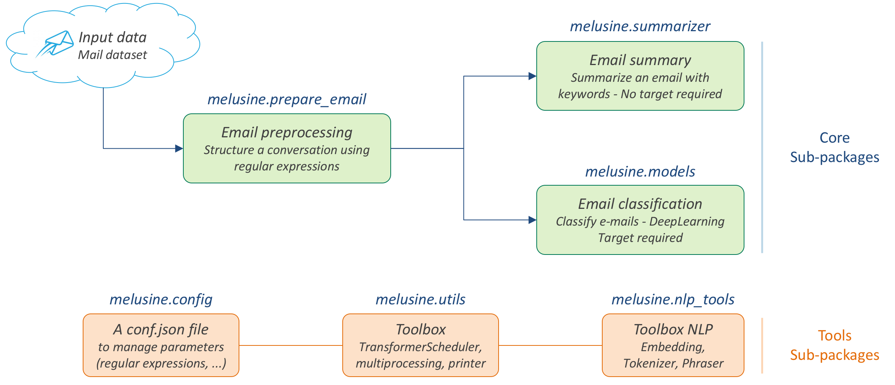
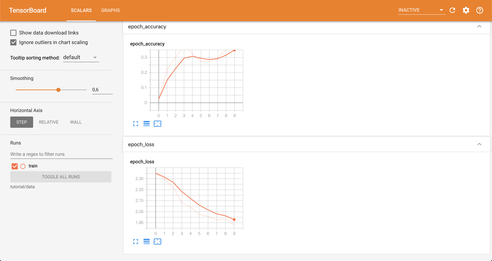

# Melusine

<!--  -->


[](https://pypi.python.org/pypi/melusine)
[](https://travis-ci.org/MAIF/melusine)
[](https://readthedocs.org/projects/melusine/)

- Free software: Apache Software License 2.0
- Documentation: [https://melusine.readthedocs.io](https://melusine.readthedocs.io).

# Overview

**Melusine** is a high-level Python library for email classification and feature extraction,
written in Python and capable of running on top of Scikit-Learn, Tensorflow 2 and Keras.
Integrated models runs with Tensorflow 2.2.
It is developed with a focus on emails written in french.

Use **Melusine** if you need a library which :
  * Supports both convolutional networks and recurrent networks, as well as combinations of the two.
  * Runs seamlessly on CPU and GPU.

**Melusine** is compatible with `Python >= 3.5`.

## Release Notes
### 2.0
New features:
  * Attentive Neural Networks are now available. :tada: We propose you an original Transformer architecture as well 
    as pre-trained BERT models (Camembert and Flaubert)
  * Tutorial 13 will explain you how to get started with these models and attempt to compare them.
  * Validation data can now be used to train models (See fit function from NeuralModel for usage)
  * The activation function can now be modified to adapt to your needs (See NeuralModel init for usage)

### 1.10.0
Updates:
  * Melusine is now running with Tensorflow 2.2
    
### 1.9.6

New features:
  * Flashtext library is now used to flag names instead of regex. It allows a faster computation.

### 1.9.5

New features:
  * An Ethics Guide is now available to evaluate AI projects, with guidelines and questionnaire. The questionnaire is based on criteria derived in particular from the work of the European Commission and grouped by categories.
  * Melusine also offers an easy and nice dashboard app with StreamLit. The App contains exploratory dashboard on the email dataset and a more specific study on discrimination between the dataset and a neural model classification.

## The Melusine package

This package is designed for the preprocessing, classification and automatic summarization of emails written in french.

<!--  -->


**3 main subpackages are offered :**

* ``prepare_email`` : to preprocess and clean emails.
* ``summarizer`` : to extract keywords from an email.
* ``models`` : to classify e-mails according to categories pre-defined by the user or compute sentiment score based on sentiment described by the user with seed words.

**2 other subpackages are offered as building blocks :**

* ``nlp_tools`` : to provide classic NLP tools such as tokenizer, phraser and embeddings.
* ``utils`` : to provide a *TransformerScheduler* class to build your own transformer and integrate into a scikit-learn Pipeline.

**An other subpackage is also provided** to manage, modify or add parameters such as : regular expressions, keywords, stopwords, etc.

* ``config`` : contains *`ConfigJsonReader`* class to setup and handle a *conf.json* file. This JSON file is the core of this package since it's used by different submodules to preprocess the data.

**2 other subpackages are offered to provide a dashboard app and ethics guidelines for AI project :**

* ``data`` : contains a classic data loader and provide a *StreamLit application* with exploratory dashboards on input data and models.

* ``ethics_guidelines`` : to provide an Ethics Guide to evaluate AI project, with guidelines and questionnaire. The questionnaire is based on criteria derived in particular from the work of the European Commission and grouped by categories.

## Getting started: 30 seconds to Melusine

### Installation

```
pip install melusine
```

To use Melusine in a project

```python
import melusine
```

### Input data : Email DataFrame

The basic requirement to use Melusine is to have an input e-mail DataFrame with the following columns:

- *body*   : Body of an email (single message or conversation history)
- *header* : Header/Subject of an email
- *date*   : Reception date of an email
- *from*   : Email address of the sender
- *to*     : Email address of the recipient
- *label* (optional): Label of the email for a classification task (examples: Business, Spam, Finance or Family)

| body                       | header         | date                           | from                         | to                             | label   |
|:---------------------------|:--------------:|:------------------------------:|:----------------------------:|:-------------------------------------:|:-------:|
| Thank you.\\nBye,\\nJohn   | Re: Your order | jeudi 24 mai 2018 11 h 49 CEST | anonymous.sender@unknown.com | anonymous.recipient@unknown.fr | label_1 |

To import the test dataset:

```python
from melusine.data.data_loader import load_email_data

df_email = load_email_data()
```


### Pre-processing pipeline

A working pre-processing pipeline is given below:

```python
from sklearn.pipeline import Pipeline
from melusine.utils.transformer_scheduler import TransformerScheduler
from melusine.prepare_email.manage_transfer_reply import check_mail_begin_by_transfer, update_info_for_transfer_mail, add_boolean_transfer, add_boolean_answer
from melusine.prepare_email.build_historic import build_historic
from melusine.prepare_email.mail_segmenting import structure_email
from melusine.prepare_email.body_header_extraction import extract_last_body
from melusine.prepare_email.cleaning import clean_body

ManageTransferReply = TransformerScheduler(
functions_scheduler=[
    (check_mail_begin_by_transfer, None, ['is_begin_by_transfer']),
    (update_info_for_transfer_mail, None, None),
    (add_boolean_answer, None, ['is_answer']),
    (add_boolean_transfer, None, ['is_transfer'])
])

EmailSegmenting = TransformerScheduler(
functions_scheduler=[
    (build_historic, None, ['structured_historic']),
    (structure_email, None, ['structured_body'])
])

Cleaning = TransformerScheduler(
functions_scheduler=[
    (extract_last_body, None, ['last_body']),
    (clean_body, None, ['clean_body'])
])

prepare_data_pipeline = Pipeline([
  ('ManageTransferReply', ManageTransferReply),
  ('EmailSegmenting', EmailSegmenting),
  ('Cleaning', Cleaning),
])

df_email = prepare_data_pipeline.fit_transform(df_email)
```

In this example, the pre-processing functions applied are:

- ``check_mail_begin_by_transfer`` : Email is a direct transfer (True/False)
- ``update_info_for_transfer_mail`` : Update body, header, from, to, date if direct transfer
- ``add_boolean_answer`` : Email is an answer (True/False)
- ``add_boolean_transfer`` : Email is transferred (True/False)
- ``build_historic`` : When email is a conversation, reconstructs the individual message history
- ``structure_email`` : Splits each messages into parts and tags them (tags: Hello, Body, Greetings, etc)

### Phraser and Tokenizer pipeline

A pipeline to train and apply the phraser end tokenizer is given below:

```python
from melusine.nlp_tools.phraser import Phraser, phraser_on_body
from melusine.nlp_tools.tokenizer import Tokenizer

phraser = Phraser(input_column='clean_body')
phraser.train(df_email)

PhraserTransformer = TransformerScheduler(
functions_scheduler=[
    (phraser_on_body, (phraser,), ['clean_body'])
])

phraser_tokenizer_pipeline = Pipeline([
  ('PhraserTransformer', PhraserTransformer),
  ('Tokenizer', Tokenizer(input_column='clean_body'))
])

df_email = phraser_tokenizer_pipeline.fit_transform(df_email)
```

### Embeddings training

An example of embedding training is given below:

```python
from melusine.nlp_tools.embedding import Embedding

embedding = Embedding(input_column='clean_body', min_count=10)
embedding.train(df_email)
```

### Metadata pipeline

A pipeline to prepare the metadata is given below:

```python
from melusine.prepare_email.metadata_engineering import MetaExtension, MetaDate, Dummifier

metadata_pipeline = Pipeline([
  ('MetaExtension', MetaExtension()),
  ('MetaDate', MetaDate()),
  ('Dummifier', Dummifier())
])

df_meta = metadata_pipeline.fit_transform(df_email)
```

### Keywords extraction

An example of keywords extraction is given below:

```python
from melusine.summarizer.keywords_generator import KeywordsGenerator

keywords_generator = KeywordsGenerator()
df_email = keywords_generator.fit_transform(df_email)
```

### Classification

The package includes multiple neural network architectures including CNN, RNN, Attentive and pre-trained BERT Networks.
An example of classification is given below:
```python
from sklearn.preprocessing import LabelEncoder
from melusine.nlp_tools.embedding import Embedding
from melusine.models.neural_architectures import cnn_model
from melusine.models.train import NeuralModel

X = df_email.drop(['label'], axis=1)
y = df_email.label

le = LabelEncoder()
y = le.fit_transform(y)

pretrained_embedding = embedding

nn_model = NeuralModel(architecture_function=cnn_model,
                       pretrained_embedding=pretrained_embedding,
                       text_input_column='clean_body')
nn_model.fit(X, y, tensorboard_log_dir="./data")
y_res = nn_model.predict(X)
```

Training with tensorflow 2 can be monitored using tensorboard :


## Glossary

### Pandas dataframes columns

Because Melusine manipulates pandas dataframes, the naming of the columns is imposed.
Here is a basic glossary to provide an understanding of each columns manipulated.
Initial columns of the dataframe:

* **body :** the body of the email. It can be composed of a unique message, a history of messages, a transfer of messages or a combination of history and transfers.
* **header :** the subject of the email.
* **date :** the date the email has been sent. It corresponds to the date of the last email message.
* **from :** the email address of the author of the last email message.
* **to :** the email address of the recipient of the last email message.

Columns added by Melusine:

* **is_begin_by_transfer :** boolean, indicates if the email is a direct transfer. In that case it is recommended to update the value of the initial columns with the information of the message transferred.
* **is_answer :** boolean, indicates if the email contains a history of messages
* **is_transfer :** boolean, indicates if the email is a transfer (in that case it does not have to be a direct transfer).
* **structured_historic :** list of dictionaries, each dictionary corresponds to a message of the email. The first dictionary corresponds to the last message (the one that has been written) while the last dictionary corresponds to the first message of the history. Each dictionary has two keys :

  - *meta :* to access the metadata of the message as a string.
  - *text :* to access the message itself as a string.

* **structured_body :** list of dictionaries, each dictionary corresponds to a message of the email. The first dictionary corresponds to the last message (the one that has been written) while the last dictionary corresponds to the first message of the history. Each dictionary has two keys :

  - *meta :* to access the metadata of the message as a dictionary. The dictionary has three keys:
    + *date :* the date of the message.
    + *from :* the email address of the author of the message.
    + *to :* the email address of the recipient of the message.

  - *text :* to access the message itself as a dictionary. The dictionary has two keys:
    + *header :* the subject of the message.
    + *structured_text :* the different parts of the message segmented and tagged as a list of dictionaries. Each dictionary has two keys:
      - *part :* to access the part of the message as a string.
      - *tags :* to access the tag of the part of the message.


* **last_body :** string, corresponds to the part of the last email message that has been tagged as `BODY`.
* **clean_body :** string, corresponds a cleaned last_body.
* **clean_header :** string, corresponds to a cleaned header.
* **clean_text :** string, concatenation of clean_header and clean_body.
* **tokens :** list of strings, corresponds to a tokenized column, by default clean_text.
* **keywords :** list of strings, corresponds to the keywords of extracted from the tokens column.

### Tags

Each messages of an email are segmented in the **structured_body** columns and each part is assigned a tag:

* `RE/TR` : any metadata such as date, from, to, etc.
* `DISCLAIMER` : any disclaimer such as `L'émetteur décline toute responsabilité...`.
* `GREETINGS` : any greetings such as `Salutations`.
* `PJ` : any indication of an attached document such as `See attached file...`.
* `FOOTER` : any footer such as `Provenance : Courrier pour Windows`.
* `HELLO` : any salutations such as `Bonjour,`.
* `THANKS` : any thanks such as `Avec mes remerciements`
* `BODY` : the core of the the message which contains the valuable information.

### Dashboard App

Melusine also offered an easy and nice dashboard app with StreamLit.
The App contains exploratory dasboard on the email dataset and more specific study on discrimination between the dataset 
and a neural model classification.

To run the app, run the following command in your terminal in the melusine/data directory :

```python
streamlit run dashboard_app.py
```


### Ethics Guidelines

Melusine also contains Ethics Guidelines to evaluate AI project.
The document and criteria are derived in particular from the work of the European Commission.


The pdf file is located in the melusine/ethics_guidelines directory :

