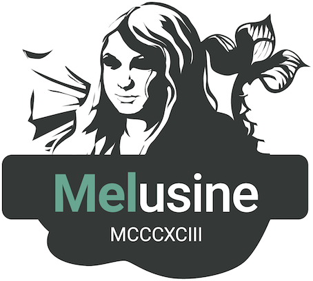

<p align="center">
<a href="https://github.com/MAIF/melusine/actions?branch=master" target="_blank">

</a>
<a href="https://pypi.python.org/pypi/melusine" target="_blank">

</a>
<a href="https://opensource.org/licenses/Apache-2.0" target="_blank">

</a>
<a href="https://shields.io/" target="_blank">

</a>
</p>

<p align="center">🎉 **BREAKING** : New major version <b>Melusine 3.0</b> is available 🎉</p>

<p align="center">
<a href="https://maif.github.io/melusine" target="_blank">

</a>
</p>

- **Free software**: Apache Software License 2.0
- **Documentation**: [maif.github.io/melusine](https://maif.github.io/melusine/)
- **Installation**: `pip install melusine`
- **Tutorials**: [Discover melusine](https://maif.github.io/melusine/tutorials/00_GettingStarted/)

## Overview

Discover Melusine, a comprehensive email processing library
designed to optimize your email workflow.
Leverage Melusine's advanced features to achieve:

- **Effortless Email Routing**: Ensure emails reach their intended destinations with high accuracy.
- **Smart Prioritization**: Prioritize urgent emails for timely handling and efficient task management.
- **Snippet Summaries**: Extract relevant information from lengthy emails, saving you precious time and effort.
- **Precision Filtering**: Eliminate unwanted emails from your inbox, maintaining focus and reducing clutter.

Melusine facilitates the integration of deep learning frameworks (HuggingFace, Pytorch, Tensorflow, etc),
deterministic rules (regex, keywords, heuristics) into a full email qualification workflow.

## Why Choose Melusine ?

Melusine stands out with its combination of features and advantages:

- **Pre-packaged Tools** : Melusine comes with out-of-the-box features such as
    - Segmenting an email conversation into individual messages
    - Tagging message parts (Email body, signatures, footers, etc)
    - Transferred email handling
- **Streamlined Execution** : Focus on the core email qualification logic
while Melusine handles the boilerplate code, providing debug mode, pipeline execution, code parallelization, and more.
- **Flexible Integrations** : Melusine's modular architecture enables seamless integration with various AI frameworks,
ensuring compatibility with your preferred tools.
- **Production ready** : Proven in the MAIF production environment,
Melusine provides the robustness and stability you need.

## Email Segmentation Exemple

In the following example, an email is divided into two distinct messages
separated by a transition pattern.
Each message is then tagged line by line.
This email segmentation can later be leveraged to enhance the performance of machine learning models.

<p align="center">
<a href="https://maif.github.io/melusine" target="_blank">

</a>
</p>

## Getting started

Explore our comprehensive [documentation](https://maif.github.io/melusine/) and tested [tutorials](https://maif.github.io/melusine/tutorials/00_GettingStarted/) to get started.
Or dive into our minimal example to experience Melusine's simplicity and power:

``` Python
    from melusine.data import load_email_data
    from melusine.pipeline import MelusinePipeline

    # Load an email dataset
    df = load_email_data()

    # Load a pipeline
    pipeline = MelusinePipeline.from_config("demo_pipeline")

    # Run the pipeline
    df = pipeline.transform(df)
```

The code above executes a default pipeline and returns a qualified email dataset with columns such as:
- `messages`: List of individual messages present in each email.
- `emergency_result`: Flag to identify urgent emails.


With Melusine, you're well-equipped to transform your email handling, streamlining processes, maximizing efficiency,
and enhancing overall productivity.
