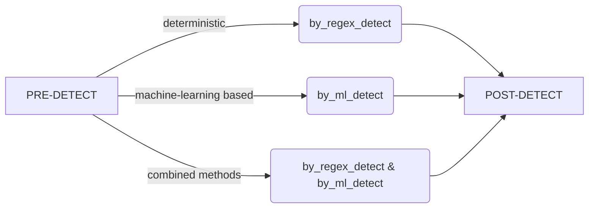

# HuggingFace's pre-trained models in the Melusine framework

  

[HuggingFace](https://huggingface.co/)


The Hugging Face library has revolutionized the landscape of natural language processing (NLP) and beyond, redefining the boundaries of what's possible in NLP and other domains and establishing itself as an indispensable tool for researchers, data scientists, and developers. By bridging the gap between cutting-edge research and practical implementation, Hugging Face not only simplifies the complexities of model deployment but also fosters innovation across industries, enabling applications that were once considered out of reach.

Renowned for its user-friendly interface and extensive collection of pre-trained models, Hugging Face empowers users to tackle a diverse range of tasks from text classification and sentiment analysis to machine translation and question answering. The library's versatility and adaptability make it a cornerstone in modern AI development, providing accurate and efficient models.

  

**Melusine** provides an exceptional framework for streamlining and optimizing email workflows with remarkable efficiency. Its flexible architecture allows seamless integration of machine learning models into its detectors, as demonstrated in the Hugging Face folder, enabling users to harness advanced AI capabilities for enhanced performance.

### Tutorial : Dissatisfaction detection using Hugging-face models

Whether it's utilizing pre-trained models from Hugging Face, such as BERT or DistilBERT, for email classification, integrating Named Entity Recognition (NER) models to extract key information, leveraging topic modeling transformers to organize emails by themes, or using language translation models to convert emails into multiple languages, all of these capabilities are seamlessly achievable through the Melusine framework.
   
By integrating these models into the Melusine framework, businesses can unlock advanced email processing capabilities, streamline workflows, and enhance productivity across their operations. Transformers-based models from Hugging Face can significantly enhance detection capabilities and act as a complementary approach to strengthen prediction.
The integration of these advanced transformations is primarily facilitated through **Melusine detectors**.

**model selection**

The selection of a model depends on the specific detection task. For example, **Sentiment detection in French text** suitable models includes camembert and distil-camembert.

  
**Implementing solution**

As usual , the detector inherites from a **MelusineTransformerDetector** base class, adheres to the standard structure of a Melusine detector, with the addition of a method enabling machine learning-based detection.
The MelusineTransformerDetector class has one additional defined method **by_ml_detect** as demonstrated below


``` python
class MelusineTransformerDetector(BaseMelusineDetector, ABC):
    """
    Defines an interface for detectors.
    All detectors used in a MelusinePipeline should inherit from the MelusineDetector class and
    implement the abstract methods.
    This ensures homogeneous coding style throughout the application.
    Alternatively, melusine user's can define their own Interface (inheriting from the BaseMelusineDetector)
    to suit their needs.
    """

    @property
    def transform_methods(self) -> list[Callable]:
        """
        Specify the sequence of methods to be called by the transform method.

        Returns
        -------
        _: list[Callable]
            List of  methods to be called by the transform method.
        """
        return [
            self.pre_detect,
            self.by_regex_detect,
            self.by_ml_detect,
            self.post_detect,
        ]

    @abstractmethod
    def pre_detect(self, row: MelusineItem, debug_mode: bool = False) -> MelusineItem:
        """What needs to be done before detection."""

    @abstractmethod
    def by_regex_detect(
        self, row: MelusineItem, debug_mode: bool = False
    ) -> MelusineItem:
        """Run detection."""

    @abstractmethod
    def by_ml_detect(self, row: MelusineItem, debug_mode: bool = False) -> MelusineItem:
        """Run detection."""

    @abstractmethod
    def post_detect(self, row: MelusineItem, debug_mode: bool = False) -> MelusineItem:
        """What needs to be done after detection (e.g., mapping columns)."""
```

**The detection method can be one of the following three**

* Purely deterministic : using the Melusine_regex fonctionality
* Machine learning-based detection : using Hugging-Face models
* Combining deterministic and machine-learning based methods




  
* In order to detect dissatisfaction emotions by regex, a DissatisfactionRegex class inheriting from melusineregex is required.

The implemntation can be found in here ! (melusine/regex/dissatisfaction_regex.py)
After constructing the DissatisfactionRegex class , the by_regex_detect method could be implemented as demonstrated in the DissatisfactionDetector! (huggingface/detectors.py/)


## The Machine Learning Approach to Detect Dissatisfaction: Two Methods


* Using a Pre-trained Model Directly
In this case a hf-token is required as menshioned in the model class.
The model can be loaded directly from the Hugging Face platform, along with its tokenizer, for immediate use in detecting dissatisfaction.

* Fine-tuning the Model : A pre-trained model can be fine-tuned using various methods, including:

    * The Hugging Face Trainer API
    * PyTorch Lightning (https://lightning.ai/docs/pytorch/stable/)

    Fine-tuning approaches:

    1- **Full Fine-Tuning**: Involves updating all layers of the model during training, typically used for adapting the model to a specific task.
    2- **LoRA (Low-Rank Adaptation)** in Parameter-Efficient Fine-Tuning (PEFT): A method designed to reduce computational and memory costs by only   fine-tuning a small subset of parameters, while maintaining high performance.
   
Fine-tuning allows customization of the model for specific tasks, improving its performance on datasets relevant to dissatisfaction detection.
A fine-tuned model could be then locally stored and loaded from path.


```python
def load_hfmodel(self, model_name="distilcamembert-base") -> None:
    """
    GET Distil-camembert-base from HF
    Parameters

    ----------

    row: MelusineItem Content of an email.
    debug_mode: bool Debug mode activation flag.
    Returns

    -------

    row: MelusineItem
    Updated row.

    """
    self.tokenizer = AutoTokenizer.from_pretrained(model_name)
    self.model = AutoModelForSequenceClassification.from_pretrained(
        model_name, num_labels=2
    )


def predict(self, text: str) -> Tuple[List, List]:
    """
    Apply model and get prediction
    Parameters
    ----------
    text: str
        Email text
    Returns
    -------
    row: MelusineItem
        Updated row.
    """

    inputs = self.tokenizer(text, padding=True, truncation=True, return_tensors="pt")
    # Forward pass through the model
    outputs = self.model(**inputs)
    # Extract logits
    self.logits = outputs.logits
    # Convert logits to probabilities using softmax
    probs = torch.nn.functional.softmax(self.logits, dim=-1)
    probs = probs.detach().cpu().numpy()
    # Convert predictions and scores to lists
    predictions = probs.argmax(axis=1).tolist()
    scores = probs.max(axis=1).tolist()
    return predictions, scores
```

       

The by_ml_detect function applies the model on a the input text. It returns both the predictions outputs and the scores outputs. A certain threshold could be then defined in the detector configuration so that the resulting prediction would be based on the score's validity and its threshold-crossing.
 

```python
def by_ml_detect(self, row: MelusineItem, debug_mode: bool = False) -> MelusineItem:
    """
    Use machine learning model to detect dissatisfaction.

    Parameters
    ----------
    row: MelusineItem
        Content of an email.
    debug_mode: bool
        Debug mode activation flag.

    Returns
    -------
    row: MelusineItem
        Updated row.
    """

    predictions, scores = self.melusine_model.predict(row[self.CONST_TEXT_COL_NAME])
    debug_info: Dict[str, Any] = {}

    row[self.DISSATISFACTION_ML_MATCH_COL], row[self.DISSATISFACTION_ML_SCORE_COL] = (
        bool(predictions[0]),
        scores[0],
    )
    # Save debug data
    if debug_mode:
        debug_info[self.DISSATISFACTION_ML_MATCH_COL] = row[
            self.DISSATISFACTION_ML_MATCH_COL
        ]
        debug_info[self.DISSATISFACTION_ML_SCORE_COL] = row[
            self.DISSATISFACTION_ML_SCORE_COL
        ]
        row[self.debug_dict_col].update(debug_info)
    return row
```

The final detection result could be defined in the **post_detect** method using a predefined condition.
[! Example ] :  condition : by_regex_detect OR (by_ml_detect and by_ml_detect.score > .9)

        
```python
def post_detect(self, row: MelusineItem, debug_mode: bool = False) -> MelusineItem:
    """
    Apply final eligibility rules.

    Parameters
    ----------
    row: MelusineItem
        Content of an email.
    debug_mode: bool
        Debug mode activation flag.

    Returns
    -------
    row: MelusineItem
        Updated row.
    """

    # Match on thanks regex & Does not contain a body
    ml_result = (row[self.DISSATISFACTION_ML_SCORE_COL] > 0.9) and row[
        self.DISSATISFACTION_ML_MATCH_COL
    ]
    deterministic_result = row[self.DISSATISFACTION_BY_REGEX_MATCH_COL]
    row[self.result_column] = deterministic_result or ml_result
    return row
```


**Melusine already automates email workflows using deterministic regex-based methods. However, the rapid growth and evolution of artificial intelligence applications in the NLP landscape remain largely untapped. This tutorial offers a glimpse into integrating state-of-the-art models into your workflows. Feel free to experiment with different model types, preprocessing methods, and use cases while maintaining the general structure of the detector. The core purpose of Melusine lies in its modularity and versatility, enabling it to handle a wide range of applications and modeling tools effectively.**


