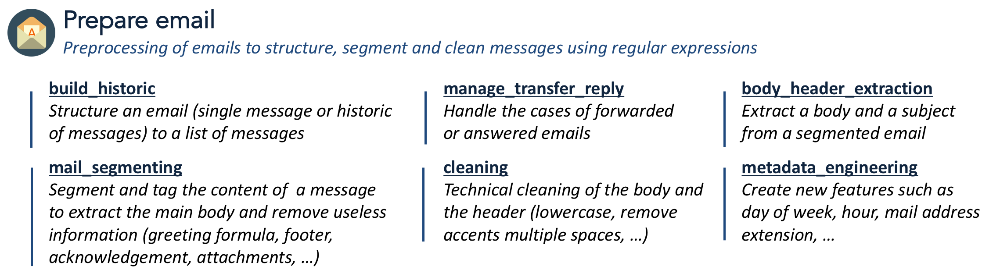

.. _prepare_email:

=======================================================
Prepare\_email subpackage :mod:`melusine.prepare_email`
=======================================================

------------------
List of submodules
------------------
.. contents::
   :local:

.. _manage_transfer_reply:

Transfer & Reply :mod:`melusine.prepare_email.manage_transfer_reply`
--------------------------------------------------------------------

.. automodule:: melusine.prepare_email.manage_transfer_reply
   :members:
   :undoc-members:
   :show-inheritance:

.. _cleaning:

Cleaning :mod:`melusine.prepare_email.cleaning`
-----------------------------------------------

.. automodule:: melusine.prepare_email.cleaning
    :members:
    :undoc-members:
    :show-inheritance:

.. _build_historic:

Build Email Historic :mod:`melusine.prepare_email.build_historic`
-----------------------------------------------------------------

.. automodule:: melusine.prepare_email.build_historic
    :members:
    :undoc-members:
    :show-inheritance:

.. _mail_segmenting:

Email Segmenting :mod:`melusine.prepare_email.mail_segmenting`
--------------------------------------------------------------

.. automodule:: melusine.prepare_email.mail_segmenting
    :members:
    :undoc-members:
    :show-inheritance:

.. _metadata_engineering:

Process Email Metadata :mod:`melusine.prepare_email.metadata_engineering`
-------------------------------------------------------------------------

.. automodule:: melusine.prepare_email.metadata_engineering
    :members:
    :undoc-members:
    :show-inheritance:

.. _body_header_extraction:

Extract Email Body & Header :mod:`melusine.prepare_email.body_header_extraction`
--------------------------------------------------------------------------------

.. automodule:: melusine.prepare_email.body_header_extraction
    :members:
    :undoc-members:
    :show-inheritance:
