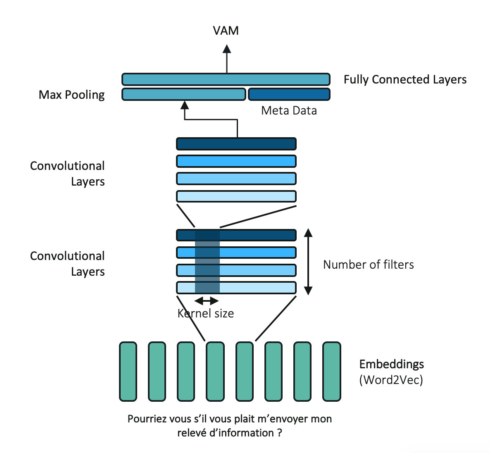
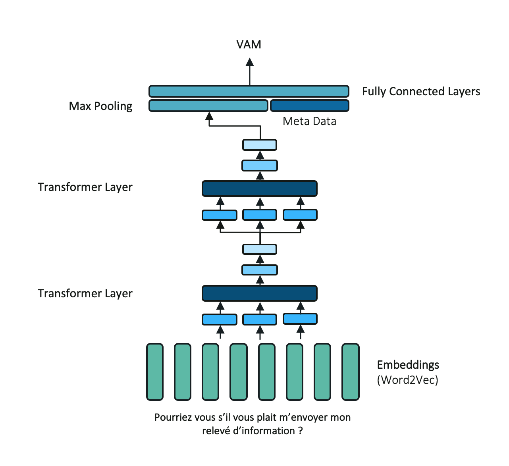

=====
Usage
=====

To use melusine in a project::

    import melusine

Melusine input data : Email DataFrames
--------------------------------------

The basic requirement to use Melusine is to have an input e-mail DataFrame with the following columns:

    - ``body``  : Body of an email (single message or conversation historic)
    - ``header``: Header of an email
    - ``date``  : Reception date of an email
    - ``from``  : Email address of the sender
    - ``to``    : Email address of the recipient
    - ``label`` (optional) : Label of the email for a classification task (examples: Business, Spam, Finance or Family)

.. csv-table::
    :header: body, header, date, from, to, label

    "Thank you.\\nBye,\\nJohn", "Re: Your order", "jeudi 24 mai 2018 11 h 49 CEST", "anonymous.sender@unknown.com", "anonymous.recipient@unknown.fr", "A"

In the examples presented below, a toy email DataFrame containing anonymized emails is used.
The toy DataFrame can be loaded as follows::

    from melusine.melusine.utils.data_loader import load_email_data

    df_emails = load_email_data()
    df_emails.head()

Prepare email subpackage : Basic usage
--------------------------------------

A common pre-processing step is to check whether an e-mail is an answer or not.
This can be done in Melusine with the function :ref:`add_boolean_answer<manage_transfer_reply>`::

    from melusine.prepare_email.manage_transfer_reply import add_boolean_answer

    df_emails['is_answer'] = df_emails.apply(add_boolean_answer, axis=1)

A new column ``is_answer`` is created containing a boolean variable:

    - True if the message is an answer
    - False if the message is not an answer

.. csv-table::
    :header: body, header, is_answer

    "Happy Birthday Bill!!", "Birthday", False
    "Thank you", "Re: Birthday", True

Create an email pre-processing pipeline
---------------------------------------

An email pre-processing pipeline takes an email DataFrame as input and executes a sequence of *Transformers*
on every email in the DataFrame.
The recommended way to create a pre-processing pipeline with Melusine is to:

    1. Wrap pre-processing functions in :ref:`TransformerScheduler<transformerScheduler>` objects.
    2. Use a `Scikit-Learn Pipeline <https://scikit-learn.org/stable/modules/generated/sklearn.pipeline.Pipeline.html>`_ object to chain transformers

Once the pipeline has been set-up, the pre-processing of an email DataFrame is straightforward:

    >>> df_emails_preprocessed = pipeline.fit_transform(df_emails)

TransformerScheduler class
^^^^^^^^^^^^^^^^^^^^^^^^^^

Functions can be wrapped in a :ref:`TransformerScheduler<transformerScheduler>` object that can be integrated into an execution Pipeline.
``TransformerScheduler`` objects are compatible with the `scikit-learn API <https://scikit-learn.org/stable/>`_
(they have fit and transform methods).

A ``TransformerScheduler`` object is initialized with a functions_scheduler argument.
The functions_scheduler argument is a list of tuples containing information about the desired pre-processing functions.
Each tuple describe an individual function and should contain the following elements:

    1. A function
    2. A tuple with the function's arguments
       (if no arguments are required, use None or an empty tuple)
    3. A column(s) name list returned by the function
       (if no arguments are required, use None or an empty list)

The code below describes the definition of a transformer::

    from melusine.utils.transformer_scheduler import TransformerScheduler

    melusine_transformer = TransformerScheduler(
    functions_scheduler=[
        (my_function_1, (argument1, argument2), ['return_col_A']),
        (my_function_2, None, ['return_col_B', 'return_col_C'])
        (my_function_3, (argument1, ), None),
    mode='apply_by_multiprocessing',
    n_jobs=4)
    ])

The other parameters of the *TransformerScheduler* class are:

    - ``mode`` (optional): Define mode to apply function along a row axis (axis=1)
      If set to 'apply_by_multiprocessing', it uses multiprocessing tool to parallelize computation.
      Possible values are 'apply' (default) and 'apply_by_multiprocessing'

    - ``n_jobs`` (optional): Number of cores used for computation. Default value, 1.
      Possible values are integers ranging from 1 (default) to the number of cores available for computation

A ``TransformerScheduler`` can be used independently or included in a scikit pipeline (recommended):

    >>> # Used independently
    >>> df_emails = melusine_transformer.fit_transform(df_emails)

    >>> # Used in a scikit pipeline
    >>> from sklearn.pipeline import Pipeline
    >>> pipeline = Pipeline([('MelusineTransformer', melusine_transformer)])
    >>> df_emails = pipeline.fit_transform(df_emails)

The *fit_transform* method returns a DataFrame with new features (new columns)

.. csv-table::
    :header: body, header, return_col_A, return_col_B, return_col_C, return_col_D

    "Happy Birthday Bill!!", "Birthday", "new_feature_A", "new_feature_B", "new_feature_C", "new_feature_D"
    "Thank you", "Re: Birthday", "new_feature_A", "new_feature_B", "new_feature_C", "new_feature_D"

Chaining transformers in a scikit-learn pipeline
^^^^^^^^^^^^^^^^^^^^^^^^^^^^^^^^^^^^^^^^^^^^^^^^

Once all the desired functions and transformers have been defined, transformers can be chained in a `Scikit-Learn Pipeline <https://scikit-learn.org/stable/modules/generated/sklearn.pipeline.Pipeline.html>`_.
The code below describes the definition of a pipeline::

    from sklearn.pipeline import Pipeline

    pipeline = Pipeline([
        ('TransformerName1', TransformerObject1),
        ('TransformerName2', TransformerObject2),
        ('TransformerName3', TransformerObject3),
    ])

Example of a working pipeline
^^^^^^^^^^^^^^^^^^^^^^^^^^^^^

A working pre-processing pipeline is given below::

    from sklearn.pipeline import Pipeline
    from melusine.utils.transformer_scheduler import TransformerScheduler
    from melusine.prepare_email.manage_transfer_reply import add_boolean_answer, add_boolean_transfer
    from melusine.prepare_email.build_historic import build_historic
    from melusine.prepare_email.mail_segmenting import structure_email

    ManageTransferReply = TransformerScheduler(
        functions_scheduler=[
            (add_boolean_answer, None, ['is_answer']),
            (add_boolean_transfer, None, ['is_transfer'])
    ])

    HistoricBuilder = TransformerScheduler(
        functions_scheduler=[
            (build_historic, None, ['structured_historic']),
    ])

    Segmenting = TransformerScheduler(
        functions_scheduler=[
            (structure_email, None, ['structured_body'])
    ])

    prepare_data_pipeline = Pipeline([
        ('ManageTransferReply', ManageTransferReply),
        ('HistoricBuilder', HistoricBuilder),
        ('Segmenting', Segmenting),
    ])

    df_emails = prepare_data_pipeline.fit_transform(df_emails)

In this example, the pre-processing functions applied are:

    - :ref:`add_boolean_answer<manage_transfer_reply>` : Email is an answer (True/False)
    - :ref:`add_boolean_transfer<manage_transfer_reply>` : Email is transferred (True/False)
    - :ref:`build_historic<build_historic>` : When email is a conversation, reconstructs the individual message historic
    - :ref:`structure_email<mail_segmenting>` : Splits parts of each messages in historic and tags them (tags: Hello, Body, Greetings, etc)

Create a custom email pre-processing function
----------------------------------------------

Creating a custom pre-processing function and adding it to a pre-processing pipeline can be done easily with *Melusine*.
Two main requirements are:

    1. Make the function compatible with the pandas apply method

        * First argument should be 'row' (Row of an email DataFrame)
            >>> def my_function(row, arg1, arg2):
        * Example: row['header'] will contain the header of a message
    2. Make sure to call existing columns of the DataFrame

        * Don't call row['is_answer'] before the 'is_answer' column has been created

The following example creates a custom function to count the occurrence of a word in the body of an email::

    import pandas as pd
    from sklearn.pipeline import Pipeline
    from melusine.utils.transformer_scheduler import TransformerScheduler
    from melusine.prepare_email.manage_transfer_reply import add_boolean_answer, add_boolean_transfer

    # Create a fake email Dataframe
    df_duck = pd.DataFrame({
        "body" : ["Lion Duck Pony", "Duck Pony Pony", "Duck Duck Pony"],
        "header" : ["zoo report", "Tr : zoo report", "Re : zoo report"]
    })

    # Define a custom function
    def count_word_occurrence_in_body(row, word):
        all_word_list = row["body"].lower().split()
        word_occurence = all_word_list.count(word)
        return word_occurence

    # Wrap function in a transformer
    CountWordOccurrence = TransformerScheduler(
    functions_scheduler=[
        (count_word_occurrence_in_body, ("duck",), ['duck_count']),
        (count_word_occurrence_in_body, ("pony",), ['pony_count']),
    ])

    # Create a second transformer with regular Melusine functions
    ManageTransferReply = TransformerScheduler(
    functions_scheduler=[
        (add_boolean_answer, None, ['is_answer']),
        (add_boolean_transfer, None, ['is_transfer'])
    ])

    # Chain transformers in a pipeline
    prepare_data_pipeline = Pipeline([
        ('CountWordOccurrence', CountWordOccurrence), # Transformer with custom functions
        ('ManageTransferReply', ManageTransferReply), # Transformer with regular Melusine functions
    ])

    # Pre-process input DataFrame
    df_duck_prep = prepare_data_pipeline.fit_transform(df_duck)

.. csv-table::
    :header: body, header, duck_count, pony_count, is_answer, is_transfer

    "Lion Duck Pony", "zoo report", "1", "1", False, False
    "Duck Duck Pony", "Re : zoo report", "2", "1", "True", "False"
    "Duck Pony Pony", "Tr : zoo report", "1", "2", False, False

Note : It is totally fine to mix regular and custom functions in a transformer.

Testing a function on a single email
------------------------------------

Since all pre-processing functions are made compatible with pandas apply function,
a function can be tested on a single email.
In the example below, the function :ref:`add_boolean_answer<manage_transfer_reply>` is tested on a single email::

    from melusine.prepare_email.manage_transfer_reply import add_boolean_answer

    email_index = 2
    email_is_answer = add_boolean_answer(df_emails.iloc[email_index])
    print("Message %d is an answer: %r" %(email_index, email_is_answer))

Output::

    "Message 2 is an answer: True"

NLP tools subpackage
--------------------

The different classes of the NLP tools subpackage are described in this section.

Phraser
^^^^^^^

The Melusine :ref:`Phraser <phraser>` class transforms common multi-word expressions into single elements:

    >>> new york -> new_york

To train a Melusine ``Phraser`` (which is based on a `Gensim Phraser <https://www.pydoc.io/pypi/gensim-3.2.0/autoapi/models/phrases/index.html>`_),
the input email DataFrame should contain a 'clean_body' column which can be created with the :ref:`clean_body<cleaning>` function.

In the example below, a ``Phraser`` is trained on a toy DataFrame::

    import pandas as pd
    from melusine.nlp_tools.phraser import Phraser
    from melusine.nlp_tools.phraser import phraser_on_text

    phraser = Phraser()
    df_new_york = pd.DataFrame({
        'clean_body' : ["new york is so cool", "i love new york", "new york city"]
    })

    phraser.train(df_new_york)

    df_new_york['clean_body'] = df_new_york['clean_body'].apply(phraser_on_text, args=(phraser,))

    # Save the Phraser instance to disk
    phraser.save('./pretrained_phraser.pickle')
    # Load the Phraser
    pretrained_phraser = Phraser().load('./pretrained_phraser.pickle')

In reality, a training set with only 3 emails is too small to train a ``Phraser``.
For illustrative purpose, the table below shows the expected output.

.. csv-table::
    :header: clean_body, clean_body_new

    "new york is so cool", "new_york is so cool"
    "i love new york",  "i love new_york"
    "new york city", "new_york city"

The specific parameters of the :ref:`Phraser <phraser>` class are:

    - ``common_terms`` : list of stopwords to be ignored (default value = stopword list from NLTK)
    - ``threshold`` : threshold to select collocations
    - ``min_count`` : minimum count of word to be selected as collocation

Tokenizer
^^^^^^^^^

A tokenizer splits a sentence-like string into a list of sub-strings (tokens).
The Melusine :ref:`Tokenizer <tokenizer>` class is based on a `NLTK regular expression tokenizer <https://www.nltk.org/api/nltk.tokenize.html>`_
which uses a regular expression (regex) pattern to tokenize the text::

    import pandas as pd
    from melusine.nlp_tools.tokenizer import Tokenizer

    df_tok = pd.DataFrame({
        'clean_body' : ["hello, i'm here to tokenize text. bye"],
        'clean_header' : ["re: hello"],
    })

    tokenizer = Tokenizer(input_column='clean_body')
    df_tok = tokenizer.fit_transform(df_tok)

A new column ``tokens`` is created with a list of the tokens extracted from the text data.

.. csv-table::
    :header: clean_body, clean_header, tokens

    "hello, i'm here to tokenize text. bye", "re: hello", "['hello', 'i', 'here', 'tokenize', 'text', 'bye']"

The specific parameters of the :ref:`Tokenizer <tokenizer>` class are:

    - ``stopwords`` : list of keywords to be ignored (this list can be defined in the conf file)
    - ``stop_removal`` : True if stopwords should be removed, else False

Embeddings
^^^^^^^^^^

With a regular representation of words, there is one dimension for each word in the vocabulary
(set of all the words in a text corpus).
The computational cost of NLP tasks, such as training a neural network model, based on such a high dimensional space can be prohibitive.
`Word embeddings <https://en.wikipedia.org/wiki/Word_embedding>`_ are abstract representations of words in a lower dimensional vector space.
One of the advantages of word embeddings is thus to save computational cost.

The Melusine :ref:`Embedding <embedding>` class uses the `Gensim Word2Vec module <https://radimrehurek.com/gensim/models/word2vec.html>`_ to train a `word2vec model <https://en.wikipedia.org/wiki/Word2vec>`_.
The trained ``Embedding`` object will be used in the :ref:`Models<models>` subpackage to train a Neural Network to classify emails.

The code below illustrates how the ``Embedding`` class works. It should be noted that, in practice, to train a word embedding model, a lot of emails are required::

    import pandas as pd
    from melusine.nlp_tools.embedding import Embedding

    df_embeddings = pd.DataFrame({
        'clean_body' : ["word text word text data word text"],
        'clean_header' : ["re: hello"],
    })

    embedding = Embedding(input_column='clean_body', min_count=3)
    embedding.train(df_embeddings)

    # Save the trained Embedding instance to disk
    embedding.save('./pretrained_embedding.pickle')

    # Load the trained Embedding instance
    pretrained_embedding = Embedding().load('./pretrained_embedding.pickle')

    # Use trained Embedding to initialise the Neural Network Model
    # The definition of a neural network model is not discussed in this section
    # nn_model = NeuralModel("...", pretrained_embedding=pretrained_embedding, "...")

Summarizer subpackage
---------------------

The main item of the :ref:`Summarizer<summarizer>` subpackage is the :ref:`KeywordGenerator<keywords_generator>` class.
The ``KeywordGenerator`` class extracts relevant keywords in the text data based on a `tf-idf <https://en.wikipedia.org/wiki/Tf–idf>`_ score.

Requirements on the input DataFrame to use a ``KeywordGenerator``:

    - KeywordGenerator requires a 'tokens' column which can be generated with a :ref:`Tokenizer <tokenizer>`

Keywords can then be extracted as follows::

    import pandas as pd
    from melusine.summarizer.keywords_generator import KeywordsGenerator
    from melusine.nlp_tools.tokenizer import Tokenizer

    df_zoo = pd.DataFrame({
        'clean_body' : ["i like lions and ponys and gorillas", "i like ponys and tigers", "i like tigers and lions", "i like raccoons and unicorns"],
        'clean_header' : ["things i like", "things i like", "things i like", "things i like"]
    })

    tokenizer = Tokenizer(input_column='clean_body')
    # Create the 'tokens' column
    df_zoo = tokenizer.fit_transform(df_zoo)

    keywords_generator = KeywordsGenerator(n_max_keywords=2, stopwords=['like'])
    # Fit keyword generator on the text data corpus (using the tokens column)
    keywords_generator.fit(df_zoo)
    # Extract relevant keywords
    keywords_generator.transform(df_zoo)

In the text data of the example, some words are very common such as "i", "like" or "things", whereas other words are rare, such as "raccoons".
The keyword generator gives priority to rare words in the keyword extraction process:

.. csv-table::
    :header: clean_body, clean_header, tokens, keywords

    "i like lions and ponies and gorillas", "things i like", "[things, i, i, lions, and, ponies, and, gorillas]", "[lions, ponys]"
    "i like ponies and tigers", "things i like", "[things, i, i, ponies, and, tigers]", "[ponies, tigers]"
    "i like tigers and lions", "things i like", "[things, i, i, tigers, and, lions]", "[tigers, lions]"
    "i like raccoons and unicorns", "things i like", "[things, i, i, raccoons, and, unicorns]", "[raccoons, unicorns]"

The specific parameters of the :ref:`KeywordGenerator<keywords_generator>` class are:

    - ``max_tfidf_features`` : size of vocabulary for tfidf
    - ``keywords`` : list of keyword to be extracted in priority (this list can be defined in the conf file)
    - ``stopwords`` : list of keywords to be ignored (this list can be defined in the conf file)
    - ``resample`` : when DataFrame contains a 'label' column, balance the dataset by resampling
    - ``n_max_keywords`` : maximum number of keywords to be returned for each email
    - ``n_min_keywords`` : minimum number of keywords to be returned for each email
    - ``threshold_keywords`` : minimum tf-idf score for a word to be selected as keyword

Models subpackage
-----------------

The main item of the Models subpackage is the :ref:`NeuralModel <train>` class.
The ``NeuralModel`` creates a Neural Network that can be trained and used to classify emails.

The minimum input features required by the ``NeuralModel`` class are the following:

    - An email DataFrame with:

        - an integer 'label' column (a label encoder can be used to convert class names into integers)
        - a 'clean_text' column with text data
    - An instance of the :ref:`Embedding <embedding>` class (Trained word embedding model)

The code below shows a minimal working example for Email Classification using a NeuralModel instance (a much larger training set is required to obtain meaningful results)::

    import pandas as pd

    # Prepare email
    from melusine.utils.transformer_scheduler import TransformerScheduler
    from melusine.prepare_email.manage_transfer_reply import \
        check_mail_begin_by_transfer, update_info_for_transfer_mail, add_boolean_answer, add_boolean_transfer
    from melusine.prepare_email.build_historic import build_historic
    from melusine.prepare_email.mail_segmenting import structure_email
    from melusine.prepare_email.body_header_extraction import extract_last_body, extract_header
    from melusine.prepare_email.cleaning import clean_body, clean_header
    from melusine.prepare_email.metadata_engineering import MetaDate, MetaExtension, Dummifier

    # Scikit-Learn API
    from sklearn.pipeline import Pipeline

    # NLP tools
    from melusine.nlp_tools.phraser import Phraser
    from melusine.nlp_tools.phraser import phraser_on_body
    from melusine.nlp_tools.phraser import phraser_on_header
    from melusine.nlp_tools.tokenizer import Tokenizer
    from melusine.nlp_tools.embedding import Embedding

    # Summarizer
    from melusine.summarizer.keywords_generator import KeywordsGenerator

    # Models
    from melusine.models.train import NeuralModel
    from melusine.models.neural_architectures import cnn_model

    # Load toy email data
    from utils.data_loader import load_email_data
    df_emails = load_email_data()

    # Transformer object to manage transfers and replies
    ManageTransferReply = TransformerScheduler(
        functions_scheduler=[
            (check_mail_begin_by_transfer, None, ['is_begin_by_transfer']),
            (update_info_for_transfer_mail, None, None),
            (add_boolean_answer, None, ['is_answer']),
            (add_boolean_transfer, None, ['is_transfer'])
        ]
    )

    # Transformer object to segment the different messages in the email, parse their metadata and
    # tag the different part of the messages
    Segmenting = TransformerScheduler(
        functions_scheduler=[
            (build_historic, None, ['structured_historic']),
            (structure_email, None, ['structured_body'])
        ]
    )

    # Transformer object to extract the body of the last message of the email and clean it as
    # well as the header
    LastBodyHeaderCleaning = TransformerScheduler(
        functions_scheduler=[
            (extract_last_body, None, ['last_body']),
            (clean_body, None, ['clean_body']),
            (clean_header, None, ['clean_header'])
        ]
    )

    # Transformer object to apply the phraser on the texts
    phraser = Phraser().load('./phraser.pickle')
    PhraserTransformer = TransformerScheduler(
        functions_scheduler=[
            (phraser_on_body, (phraser,), ['clean_body']),
            (phraser_on_header, (phraser,), ['clean_header'])
        ]
    )

    # Tokenizer object
    tokenizer = Tokenizer(input_column="clean_body")

    # Full preprocessing pipeline
    PreprocessingPipeline = Pipeline([
        ('ManageTransferReply', ManageTransferReply),
        ('Segmenting', Segmenting),
        ('LastBodyHeaderCleaning', LastBodyHeaderCleaning),
        ('PhraserTransformer', PhraserTransformer),
        ('tokenizer', tokenizer)
    ])

    # Apply preprocessing pipeline to DataFrame
    df_emails = PreprocessingPipeline.fit_transform(df_emails)

    # Pipeline to extract dummified metadata
    MetadataPipeline = Pipeline([
        ('MetaExtension', MetaExtension()),
        ('MetaDate', MetaDate()),
        ('Dummifier', Dummifier())
    ])

    # Apply MetaData processing pipeline to DataFrame
    df_meta = MetadataPipeline.fit_transform(df_emails)

    # Keywords extraction
    keywords_generator = KeywordsGenerator(n_max_keywords=3)
    df_emails = keywords_generator.fit_transform(df_emails)

    # Train an embedding with the 'clean_body' data
    pretrained_embedding = Embedding(input_column='clean_body', min_count=3)
    pretrained_embedding.train(df_emails)

    # Create a 'clean_text' column from the 'clean_header' and 'clean_body' columns
    df_emails['clean_text'] = df_emails['clean_header']+'. '+df_emails['clean_body']

    # Create a training set DataFrame with MetaData + the 'clean_text' columns
    X = pd.concat([df_emails['clean_text'],df_meta],axis=1)

    # The 'label' column contains target labels for email classification
    # Labels should be encoded ('Family', 'Work', 'Sport' => 1, 2, 3)
    from sklearn.preprocessing import LabelEncoder
    y = df_emails['label']
    le = LabelEncoder()
    y = le.fit_transform(y)

    # CNN model with 'clean_text' as text_input and 'extension', 'dayofweek', 'hour', 'min'
    # as metadata input
    nn_model = NeuralModel(neural_architecture_function=cnn_model,
                           pretrained_embedding=pretrained_embedding,
                           text_input_column="clean_text",
                           meta_input_list=['extension', 'dayofweek', 'hour', 'min'],
                           n_epochs=10)

    # Train the Neural Network model
    nn_model.fit(X,y)

    # Predict labels on the training dataset
    y_res = nn_model.predict(X)

    # Decode prediction results (1, 2, 3 => 'Family', 'Work', 'Sport')
    y_res = le.inverse_transform(y_res)

    # Print results
    print(y_res)

The specific parameters of the :ref:`NeuralModel <train>` class are:

    - ``neural_architecture_function`` : function which returns a Neural Network Model instance from `Keras <https://keras.io>`_
    - ``pretrained_embedding`` : pretrained embedding (:ref:`Embedding <embedding>` class object)
    - ``text_input_column`` : input text column to consider for the model (Example: 'clean_body')
    - ``meta_input_list`` : list of the names of the columns containing the metadata
      If empty list or None the model is used without metadata
      Default value, ['extension', 'dayofweek', 'hour', 'min']
    - ``vocab_size`` : size of vocabulary for neural network model
    - ``seq_size`` : maximum size of input for neural model
    - ``loss`` : loss function for training (Default 'categorical_crossentropy')
    - ``batch_size`` : size of batches for the training of the neural network model
    - ``n_epochs`` : number of epochs for the training of the neural network model

We integrate 3 main classifier neural networks, respectively recurrent, convolutional and attentive.
Each of the proposed architecture employs a distinct mathematical operation.

Recurrent Neural Network Classifier (RNN)
^^^^^^^^^^^^^^^^^^^^^^^^^^^^^^^^^^^^^^^^^
RNN are traditionally used with textual data as they are specifically designed to handle sequentially structured data. Inputs are sequentially computed given a cell operation, generally a LSTM or GRU cell. at each step, the current input as well as the output from the previous step are used to compute the next hidden state. The proposed architecture includes a 2-layers bidirectional GRU networks. The network last hidden state is used as the final sentence embedding.

.. image:: ./_static/rnn-model.png
  :align: center
  :scale: 50%

Convolutional Neural Network Classifier (CNN)
^^^^^^^^^^^^^^^^^^^^^^^^^^^^^^^^^^^^^^^^^^^^^
CNN uses multiple filters to distinguish patterns in data. Such filters are assembled across the hidden layers to build more complex patterns and structures. The last layer should therefor capture a global and generic representation of the data. In our architecture, we use a two hidden layers CNN with respectively 200 filters for each hidden layer. The last hidden states are aggregated using a max pooling operation.

Attentive Neural Network Classifier
^^^^^^^^^^^^^^^^^^^^^^^^^^^^^^^^^^^
Attentive-based neural networks are fairly new in the NLP community but results are extremely promising. They rely on the self-attention operation which computes hidden states as a weighted sum from the inputs. As the multiple filters in the CNN architecture, the multi-branch attention aggregate multiple attention operation to capture various properties from the input. Such operation is easily perform on GPU infrastructure. We propose an architecture inspired from previously introduced RNN and CNN architecture with a two layers multi-branch attention module follow by a max pooling operation.

BERT Neural Network Classifier
^^^^^^^^^^^^^^^^^^^^^^^^^^^^^^
We also propose a wrap-up for the popular pre-trained bert architecture.
Bidirectional Encoder Representations from Transformers (BERT) take into account the context for each occurrence of a given word and will provide a contextualized embedding that will be different according to the sentence. However, we only use the first word embedding, usually called the classification token in our classifier model.
We made available the two trending French models Camembert and Flaubert.

.. image:: ./_static/bert-model.png
  :align: center
  :scale: 50%

Use a custom config file
------------------------

To optimize Melusine for your needs, a custom configuration file may be used.
Through a custom configuration file, the user can specify parameters such as:

    - Custom keywords : List of keywords that Melusine should focus on
        - Example: extract keywords with the KeywordExtractor
    - Custom stopwords : List of stopwords that Melusine should ignore
        - Example: tokenize sentences with a Tokenizer
    - Custom regular expressions (regex) : regex used in the melusine functions
        - Example: Regex to detect that a message is a reply

The following code shows how to specify a custom configuration file::

    from melusine.config.config import ConfigJsonReader

    conf = ConfigJsonReader()

    # Print the path to the current configuration file
    with open(conf.path_ini_file_, 'r') as ini_file:
        print(ini_file.read())

    # Print the content of the current configuration file
    conf_dict = conf.get_config_file()
    print(conf_dict)  # will print the json

    # Set a new path to the configuration file
    conf.set_config_path(file_path='my/path/conf.json')

    # Print the new path to the configuration file
    with open(conf.path_ini_file_, 'r') as ini_file:
        print(ini_file.read())

    # Print the content of the new configuration file
    conf_dict = conf.get_config_file()
    print(conf_dict)  # will print the json

It is also possible to go back to the original configuration file::

    from melusine.config.config import ConfigJsonReader

    conf = ConfigJsonReader()
    conf.reset_config_path()

Warning : the configuration file is loaded by the different modules (Tokenizer, KeywordExtractor, etc) during the import,
therefore, for the new configuration file to be effective, the code / kernel should be restarted after each modification of the configuration file.

Use a custom name file
------------------------

While working with text data, names might undergo specific processing:

- stopword processing : if names don't need to be identified, they may be discarded during the text processing
- flagging : if names need to be identified but not specifically, names may be replaced with a name_flag (bob -> flag_name)

By default, Melusine identifies names using an explicit list of names available in a file ('melusine/config/names.csv').
The default name list was adapted from a name dataset publicly available on the french government `website <https://www.data.gouv.fr/fr/datasets/ficher-des-prenoms-de-1900-a-2018/>`_.
This list contains first names given to children (french or not) born in France between 1900 and 2018.

Melusine users may specify a **custom name list** using a **custom 'names.csv' file**.

The following code shows how to specify a custom configuration file::

    import os
    import pandas as pd
    from melusine.config.config import ConfigJsonReader

    conf = ConfigJsonReader()

    # Print the path to the current name file
    with open(conf.path_ini_file_, 'r') as ini_file:
            print(ini_file.read())

    # Print the current name list
    conf_dict = conf.get_config_file()
    print(conf_dict['words_list']['names'][:5])

    ### Use a custom name file
    # 1. Create a new (custom) name file
    #    - The file should be a csv file with a column called `Name`
    # 2. Set the new file as the current Melusine name file    with open(conf.path_ini_file_, 'r') as ini_file:
    # Set a new path to the configuration file

    # Create a name DataFrame
    df_names = pd.DataFrame({'Name' : ['Daenerys', 'Tyrion', 'Jon', 'Raegar']})

    # Path to the new name.csv file
    new_path = os.path.join(os.getcwd(), 'data', 'names.csv')

    # Save new name.csv file
    df_names.to_csv(new_path, encoding="latin-1", sep=";", index=False)

    # Set a new path to the name file in Melusine
    conf.set_name_file_path(file_path=new_path)

    # Print the new path to the name file
    with open(conf.path_ini_file_, 'r') as ini_file:
        print(ini_file.read())

    # Print the new file list
    conf_dict = conf.get_config_file()
    print(conf_dict['words_list']['names'][:5])

It is possible to go back to the original name file::

    from melusine.config.config import ConfigJsonReader

    conf = ConfigJsonReader()
    conf.reset_name_file_path()

    conf_dict = conf.get_config_file()
    print(conf_dict['words_list']['names'][:5])

Warning : the name file is loaded by the different modules (Tokenizer, KeywordExtractor, etc) during the import,
therefore, for the new name file to be effective, the code / kernel should be restarted after each modification of the name file.
